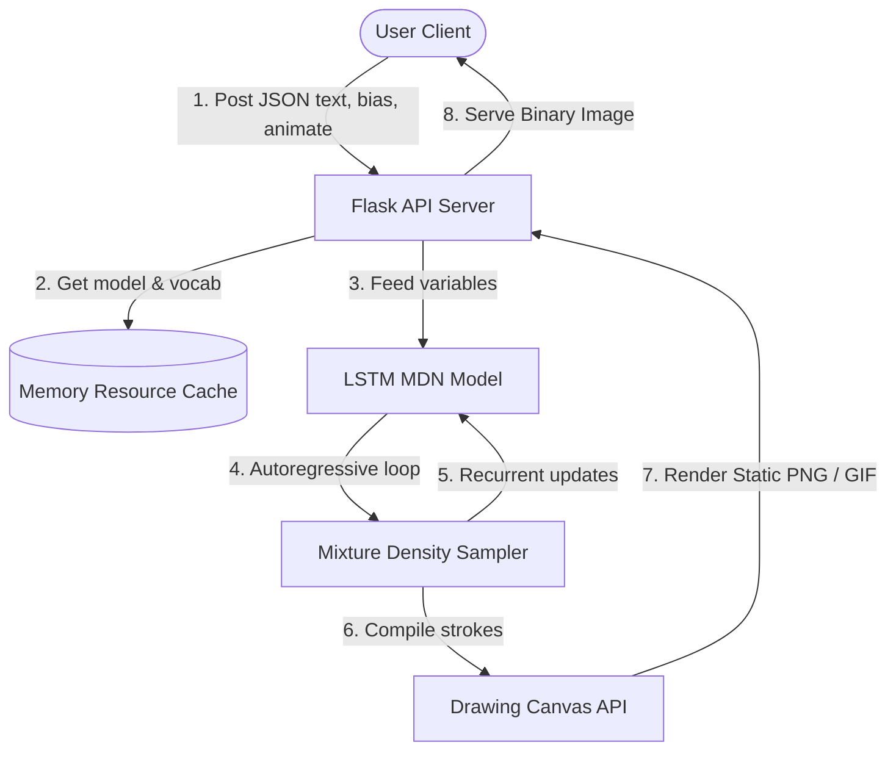

# Generative Handwriting Synthesis System

A production-grade, containerized machine learning application that generates authentic, continuous handwriting strokes from text inputs. This project is a complete **PyTorch software implementation** of the handwriting generation pipeline, developed and engineered by **Amad Mateen**. 

The system features high-performance memory caching, thread-safe server execution scopes, and an interactive, highly aesthetic dark visual client. The core sequence generation architecture is inspired by the recurrent LSTM network, Mixture Density Network (MDN), and soft window alignment attention frameworks introduced in Alex Graves' 2013 research.

Deployed as an interactive, highly responsive web interface on Hugging Face Spaces.

---

## 📋 Business Case & Applications

Automated synthesis of human-like handwriting has multiple high-value applications:
* **Hyper-Personalized Marketing**: Scale direct mail campaigns with organically written letters instead of generic computer fonts.
* **Accessibility Tools**: Provide personalized communication interfaces for individuals with motor-impairments who cannot write by hand.
* **Synthetic Data Generation**: Produce high-variance labeled handwriting images to train OCR (Optical Character Recognition) networks, bypassing privacy and scaling boundaries.

---

## 🛠️ System Architecture

The handwriting synthesis pipeline is designed around a three-tier decoupled architecture:
1. **User Interface (Web)**: Interactive, stylized React frontend allowing dynamic adjustments to input text, sampling neatness (bias), and animations.
2. **Server API (Flask)**: High-concurrency web service that implements thread-safe model execution, style caching, and warm-up boots.
3. **Core ML Engine (PyTorch)**: Decoupled and optimized inference pipeline carrying out autoregressive stroke generation and coordinate plotting.



---

## 📁 Repository Structure

```text
├── data/
│   ├── sentences.txt          # Corpus of text lines used to build vocabulary
│   └── strokes.npy            # Raw training coordinate coordinates (kept for training compatibility)
├── model/
│   └── handwriting_synthesis_model.pt  # Pre-trained PyTorch LSTM weight parameters (15MB)
├── Notebook/
│   └── handwriting_synthesis_rnn.ipynb # Jupyter Notebook with model training, validation, and metrics
├── src/
│   ├── __init__.py            # Python package initialization
│   ├── config.py              # Central configurations, paths, device rules, and constants
│   ├── dataset.py             # Custom Dataset class and statistics normalizations (training split)
│   ├── inference.py           # Thread-safe loading, caching, validation, and generation wrapper
│   ├── model.py               # HandWritingSynthesisNet and Gaussian Mixture sampling layers
│   └── visualization.py       # Matplotlib drawing canvas and animation builders
├── frontend/
│   ├── index.html             # Client interface skeleton and SEO settings
│   ├── App.jsx                # React state-machine (bias slider, validation, preset triggers)
│   └── styles.css             # Glassmorphism dark layout and micro-animations rules
├── app.py                     # Entry point Flask web server
├── main.py                    # Backward-compatible CLI testing tool
├── Dockerfile                 # Container image specification (Python-slim, system deps)
├── requirements.txt           # Locked deployment python packages dependencies
└── README.md                  # System overview and portfolio documentation
```

---

## 🧪 Model Details

The model represents a recurrent neural network mapping characters to coordinates offsets:
* **Sequence Alignment (Soft Window)**: An attention layer maps input text characters to stroke time-steps.
* **Autoregressive Recurrent Core**: Three LSTM layers process the character attention vectors combined with the previous stroke coordinate point $(x_t, y_t, eos_t)$.
* **Mixture Density Networks (MDN)**: The output of the LSTM projects parameters of a Bivariate Gaussian Mixture Model (20 mixture components) representing the probability distribution of the next offset $(\Delta x_{t+1}, \Delta y_{t+1})$ and a Bernoulli distribution for the end-of-stroke indicator.
* **Sampling Bias (Temperature)**: Tapping into the model output, a bias variable scales down coordinate variance. High bias ($>10$) results in very clean, uniform handwriting, while low bias ($<1.0$) results in highly stylistic, creative, or messy strokes.

---

## 💻 Setup & Local Execution

### 1. Prerequisite Environments
Ensure you have **Python 3.11** (or compatible release) installed. Create a clean virtual environment:
```bash
python -m venv .venv
source .venv/bin/activate  # On Windows: .venv\Scripts\activate
```

### 2. Install Packages
```bash
pip install -r requirements.txt
```

### 3. Local CLI Execution
You can test the generation engine directly inside the terminal:
```bash
python main.py
```
This utility prompts for the input string, sampling bias, and animation options, writing the resulting image to the local `./outputs` directory.

### 4. Local Web Server Execution
Start the local server:
```bash
python app.py
```
Open [http://localhost:7860](http://localhost:7860) in your browser.

---

## 🐳 Containerized Execution (Docker)

To run the application locally inside a Docker container matching the Hugging Face environment:

```bash
# Build the container image
docker build -t handwriting-synthesizer .

# Run the container mapping port 7860
docker run -p 7860:7860 handwriting-synthesizer
```
Navigate to [http://localhost:7860](http://localhost:7860).

---

## 🚀 Hugging Face Spaces Deployment

This repository is fully configured for continuous integration on Hugging Face Spaces using the Docker SDK:
1. Create a new Space on [Hugging Face](https://huggingface.co/new-space).
2. Select **Docker** as the SDK (with a Blank/Custom template).
3. Connect your Git remote or upload files directly.
4. The space will automatically detect `Dockerfile` and `requirements.txt` to trigger a build and launch.

---

## ⚠️ Limitations & Future Work

* **Vocabulary Constraints**: The model is trained on a specific vocabulary. Characters outside the supported character set (e.g. `@`, `$`, `%`, or emoji) are rejected by front-end and back-end validation to prevent crash inputs.
* **Static Normalization**: Parameters are locked in config based on the corpus training split. Adding new styles requires retraining the weights.
* **Planned Improvements**:
  - Integrate Custom User Uploaded Priming Styles.
  - Upgrade front-end asset pre-compilation to Vite/Webpack for enterprise deployment pipelines.
